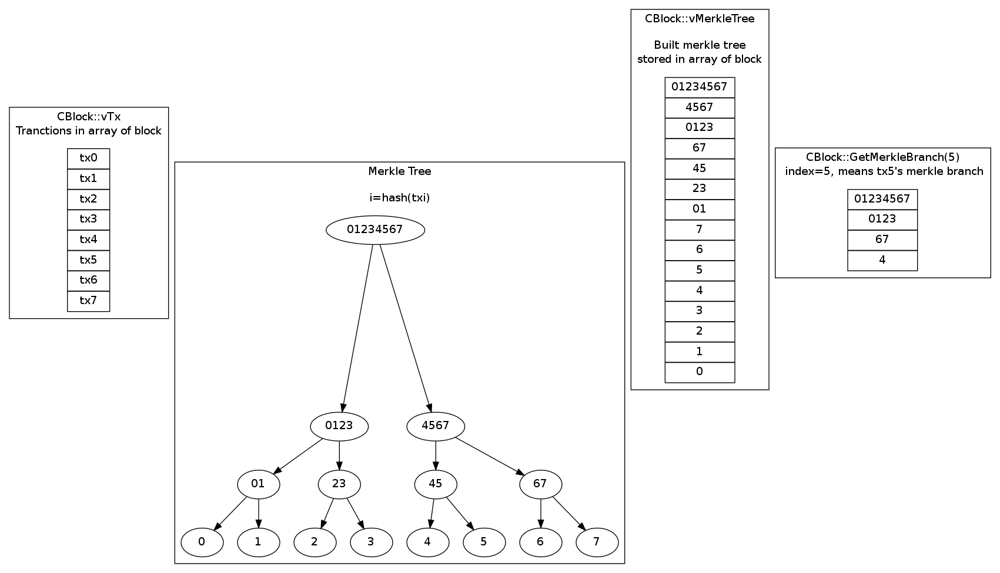

# Getting Start

I want to write this book with the programmer's phillosopy which including:

* Do not rewrite the knowledge points which have bee done very well already or you are not familair with them.  
Like Berkeley Database and Level Database, we just show the where the contents are and read which snippets for understanding bitcoin.

# Chapter 0 - Fundamental Middlewares
## Berkeley DB
A greate web site about [Berkeley DB](http://www.stanford.edu/class/cs276a/projects/docs/berkeleydb/). You do not need to read all of them, just the snippet [Getting Started: A Simple Tutorial](http://web.deu.edu.tr/doc/berkeley/berkeleyDB/ref/simple_tut/intro.html) is enough. And you can reference the [C++ API](http://www.stanford.edu/class/cs276a/projects/docs/berkeleydb/api_cxx/c_index.html) or the [Tutorial and Reference Guide](http://www.stanford.edu/class/cs276a/projects/docs/berkeleydb/reftoc.html) if encountering them in bitcoin source code.

### Dbt

### DbTxn 
[Tansaction System](http://www.stanford.edu/class/cs276a/projects/docs/berkeleydb/ref/txn/intro.html)

### Dbc

## Level Database

## OpenSSL

### BIGNUM

## Boost
### boost::variant

typedef boost::variant\<CNoDestination, CKeyID, CScriptID\> CTxDestination;

## Serialize/Unserialize

## Qt

# Chapter 1 - Bitcoin Protocol

## Block
### Block Size
The maximum allowed size for a serialized block, in bytes (network rule)  
static const unsigned int MAX_BLOCK_SIZE = 1000000;

### Merkle Tree
* build merkle Tree and merkle branch  
`CBlock::BuildMerkleTree()`  
`CBlock::GetMerkleBranch()`

* build merkle branch

## coin total mount
static const int64_t MAX_MONEY = 21000000 * COIN;  
static const int64_t COIN = 100000000; 

## Transaction
[CTransaction::nLockTime](https://en.bitcoin.it/wiki/NLockTime)  
[CTxIn::nSequence](http://bitcoin.stackexchange.com/questions/2025/what-is-txins-sequence)  
<https://en.bitcoin.it/wiki/Protocol_specification#tx>

## URI

## Script
<https://en.bitcoin.it/wiki/Script>

U1 ---TA--> U2 ---TB--> U3

scriptPubKey: OP_DUP OP_HASH160 <pubKeyHash> OP_EQUALVERIFY OP_CHECKSIG
scriptSig: <sig> <pubKey>
TA = { out{scriptPubKey}, in{scriptSig} }
   = { out{... <U2 pubkeyHash> ...}, in{scriptSig} }
TB = { out{scriptPubKey}, in{scriptSig} }
   = { out{scriptPubKey}, in{<sig> <U2 pubkey>} }

<sigA> <pubkeyA> OP_CHECKSIGVERIFY OP_CODESEPARATOR <sigB> <pubkeyB> OP_CHECKSIG

the transaction that uses SIGHASH_SINGLE type of signature should not have more outputs than inputs

## Dust
<http://bitcoin.stackexchange.com/questions/10986/what-is-meant-by-bitcoin-dust>

# Chapter 1 - Bitcoin Wallet

A CWallet is an extension of a keystore, which also maintains a set of transactions and balances,
and provides the ability to create new transactions.

## Data Format in DB
The wallet data is store in berkley database.
log dir: ~/.bitcoin/database, error file: ~/.bitcoin/db.log

<https://en.bitcoin.it/wiki/Wallet>

-------------------------------
Key            Note
---            ----------------
minversion     12.0 Example of a row that

name           xxx

purpose        `[054] 2448 len:  43 data: \7purpose"18Q7c6wM6VLFEKN8jqtJeop8DoQtKvbyT3`

               `[055] 2436 len:   8 data: \7receive`
tx

acentry        Database key is acentry\<account\>\<counter\>

key/wkey       `"key"[pubkey] => [privkey][hash(pubkey,privkey)]`

mkey

ckey

keymeta

defaultkey

pool

version

cscript

oderposnext

-------------------------------

You can dump the ~/.bitcoin/wallet.dat to analyz key and value paires:

	jfeng@jfeng:~/Project/utils/pandoc$ db_dump -d a ~/.bitcoin/wallet.dat
	...
	[060] 2368 len:  11 data: \adefaultkey
	[061] 2328 len:  34 data: 2102197ba6e75316374614d4b0e6e19bea40f997468274b0437ea3c7089bb7502247
	...
	// name
	[016] 1480 len:  40 data: \4name"18Q7c6wM6VLFEKN8jqtJeop8DoQtKvbyT3
	[017] 1468 len:   6 data: 05656e6e6978
	[018] 1424 len:  40 data: \4name"1DHBgRXxXGHJcaQ2jD268vVVtNF1HQ1Fiy
	[019] 1412 len:   6 data: 05656d6d6978
	[020] 1320 len:  40 data: \4name"1DgLeFyfSffy5B4AQzhbSLXHfR7sjGfVc1
	[021] 1308 len:   6 data: 05656d6d6978
	[022] 1368 len:  40 data: \4name"1K3Ak2aU7YyUdyrX5wYRfJLTTz1wUF2Hsj

	// minversion
	[062] 2312 len:  11 data: \aminversion
	[063] 2304 len:   4 data: 60ea0000 

## Class Structure

![](http://yuml.me/diagram/scruffy/class/
   [CDBEnv]->[BerkeleyDB{bg:yellow}],
   [CDB]-CDBEnv bitdb>[CDBEnv],
   [CDB]->[BerkeleyDB{bg:yellow}],
   [CDB]->[CDataStream],
   [CDB]^-[CWalletDB], 
   [CAutoBN_CTX]-BIGNUM->[OpenSSL{bg:yellow}],
   [CBigNum]->[CAutoBN_CTX],
   [CBigNum]-BIGNUM->[OpenSSL{bg:yellow}],
   [CBase58Data]->[CBigNum],
   [CBase58Data]^-[CBitcoinAddress],
   [CBitcoinAddress]->[CTxDestination],
   [CBitcoinAddress]->[CKeyID],
   [CBitcoinAddress]->[CScriptID],
   [uint160]^-[CKeyID],
   [uint160]^-[CScriptID],
   [base_uint base_uint160]^-[uint160],
   [CWalletDB]->[CBitcoinAddress],
   [CWalletDB]->[CPubKey],
   [CWallet]<->[CWalletDB],
   [CryptoKeyStore]^-[CWallet],  
   [<<CWalletInterface>>]^-.-[CWallet], 
   [CWallet]<->[CWalletTx],
   [CMerkleTx]^-[CWalletTx],
   [CTransaction]^-[CMerkleTx],
   [CTransaction]->[CTxIn],
   [CTxIn]->[CScript],
   [CTXIn]->[COutPoint],
   [CTransaction]->[CTxOut],
   [CWallet]->[CKey],
   [CKey]->[CECKey],
   [CECKey]-EC_KEY->[OpenSSL{bg:yellow}],
   [CWallet]->[CKeyMetadata],
   [CWallet]->[CCryptoKeyStore],
   [CWallet]->[CPubKey])

## Bitcoin Address

You can refer to [Bitcoin Address](https://en.bitcoin.it/wiki/Technical_background_of_Bitcoin_addresses) about what is and how to create the bitcoin address.  
The last step of creating bitcoin address is to use [Base58Checking encoding](https://en.bitcoin.it/wiki/Base58Check_encoding). The base58 encoding is the same as
decimal or hex encoding. It uses 58 symbols to encode values. For deep understanding, you can read the EncodeBase58Check() and DecodeBase58Check()
in [base58.h](https://github.com/bitcoin/bitcoin/blob/master/src/base58.h)

[what-are-the-different-prefixes-of-bitcoin-addresses](http://bitcoin.stackexchange.com/questions/13174/what-are-the-different-prefixes-of-bitcoin-addresses)

Some points should be noted while reading source code:

* In BIGNUMs the representation of negative numbers with the MSB set is  prefixed with null byte  

>
	inline bool DecodeBase58(const char* psz, std::vector<unsigned char>& vchRet)
	{
	   ...
	  // Trim off sign byte if present
	  // BN_bn2mpi() and BN_mpi2bn() convert BIGNUMs from and to a format that consists of the number's length in bytes represented as a 4-byte big-endian number,
	  // and the number itself in big-endian format, where the most significant bit signals a negative number (the representation of numbers with the MSB set is 
	  // prefixed with null byte).
	  if (vchTmp.size() >= 2 && vchTmp.end()[-1] == 0 && vchTmp.end()[-2] >= 0x80)
		vchTmp.erase(vchTmp.end()-1);
	   ...
	} 
	
* (1 byte verstion ) + (20 bytes evolved from pub key) + (4 byte checksum) ====base58===> bitcoin address 

>
	bool IsValid() const
	{
	    // (1 byte version) + (20 byte) + (4 byte checksum)
            // vchData has stripped the version and checksum, so it is 20 byptes 
	    bool fCorrectSize = vchData.size() == 20;
	    bool fKnownVersion = vchVersion == Params().Base58Prefix(CChainParams::PUBKEY_ADDRESS) ||
	                         vchVersion == Params().Base58Prefix(CChainParams::SCRIPT_ADDRESS);
	    return fCorrectSize && fKnownVersion;
	}

* The encoding includes a version byte, which affects the first character in the address
[List of address prefix](https://en.bitcoin.it/wiki/List_of_address_prefixes). For lastest you can refer to
[chainparams.cpp](https://github.com/bitcoin/bitcoin/blob/master/src/chainparams.cpp)

>
	// CMainParams
	148         base58Prefixes[PUBKEY_ADDRESS] = list_of(0);
	149         base58Prefixes[SCRIPT_ADDRESS] = list_of(5);
	150         base58Prefixes[SECRET_KEY] =     list_of(128);
	151         base58Prefixes[EXT_PUBLIC_KEY] = list_of(0x04)(0x88)(0xB2)(0x1E);
	152         base58Prefixes[EXT_SECRET_KEY] = list_of(0x04)(0x88)(0xAD)(0xE4);
	// CTestNetParams
	212         base58Prefixes[PUBKEY_ADDRESS] = list_of(111);
	213         base58Prefixes[SCRIPT_ADDRESS] = list_of(196);
	214         base58Prefixes[SECRET_KEY]     = list_of(239);
	215         base58Prefixes[EXT_PUBLIC_KEY] = list_of(0x04)(0x35)(0x87)(0xCF);
	216         base58Prefixes[EXT_SECRET_KEY] = list_of(0x04)(0x35)(0x83)(0x94);

Also some good blogs for your understandings of bitcoin address:   
<http://torspot.com/bitcoin-address/>  
<http://p2pbucks.com/?p=4162>  

## Send to Address
<http://blog.163.com/moro80@126/blog/static/166300187201151010054194/>

## CWallet::mapWallet

# Chapter 2 - Bitcoin QT

#
